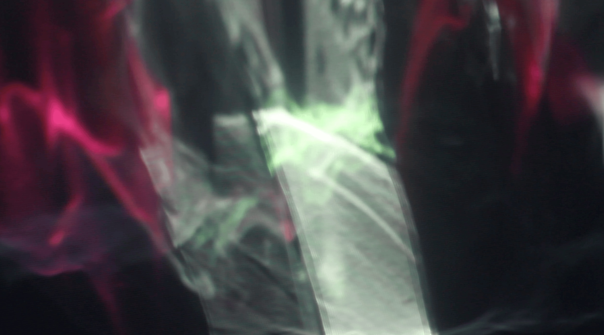

# Survey of Alternative Displays - 2024 Update Notes

<figure><figcaption></figcaption></figure>

(Original version from [Blair Neal](https://www.ablairneal.com))

This article was originally [created and hosted on Medium](https://laserpilot.medium.com/survey-of-alternative-displays-82d928480b9d), but its length on a single page made it very unweildy to keep it updated with fresh content. The original was made in 2015, with a major revision in 2022. In 2024 I added a bunch more and reconfigured some categories.

This update will be ongoing and some sections may be more updated than others. Gitbook may not be the final resting place but it seems like the best approach for now.

🌟If you're on Github: This page is auto generated by Gitbook and is more readable [at the link here](https://blair-neal.gitbook.io/survey-of-alternative-displays/), especially for things like embedded videos.

If you're on Gitbook, the link to the [Github for this article is here](https://github.com/laserpilot/Survey\_of\_Alternative\_Displays). Please contribute if you'd like!

If your project or image is featured here and you would prefer me to remove it, please send me a message/email/etc (contact info on [my website](https://www.ablairneal.com)). Additionally, if you have something you think needs to change or be added, please submit a pull request and I'll add it in (or send me an email!).

## To add/Added in 2024:

* Recategorize:
  * ✅ Need to change Lightfield category to capture things like autostereoscopic lenticular and multiview. Need to move Looking Glass
  * ✅ Might need to update "Volumetric" to be things like swept volume
* Add sections on:
  * ✅ What is a "display"?
  * (not in yet) How do I find the right kind of display for my use case? What environmental factors make some displays a better use than others? Perhaps a display matrix with different conditions that are highlighted?
  * ✅Anaglyph glasses? Chromadepth?
  * (not in yet) Depth cues? (already in Misleading terms, but could be broken out more)
  * ✅What are qualities of an ideal display?
  * ✅What is the promise of a holographic display?
  * ✅Add Circular or Non Rectangular display category
* Displays or companies to add:
  * ✅ JDI 8K Light Field Display from 2019
  * ✅ Projection Scrim:
    * ✅ Hologauze
    * ✅ Carbon Black
  * ✅ Multiview:
    * ✅ Real Fiction Multiview
    * ✅ USC Multiview with 72 projectors
  * Head Mounted displays
    * ✅ SWave (could also be considered experimental)
  * Kinetic:
    * ✅ PJ-Link 3D LED TV Display - actuated LED panels
  * ✅ Autostereoscopic
    * ✅ Seecubic
    * ✅Lightspace Technologies
    * ✅ Sony Spatial Reality
    * ✅ Dimenco (Leia?)
  * ✅ Light Field or Field of Light Displays:
    * ✅ Avalon Holographics
  * Swept Volume
    * ✅[USC Rotating Display](https://www.youtube.com/watch?v=8gvPS1m40gw\&t=55s)
    * ✅Mini volumetric - [https://youtu.be/HKpBhE7QVAI?si=4uf6Si9HyYOtIBYa](https://youtu.be/HKpBhE7QVAI?si=4uf6Si9HyYOtIBYa)
  * Optical/peppers ghost
    * ✅ ASKA3D
  * Kinetic:
    * [https://www.fluidreality.com/](https://www.fluidreality.com/)
    * ✅ Pj Link mechanical (didnt add all of these, but most):
      * [https://www.youtube.com/watch?v=CNYp\_R1sriw](https://www.youtube.com/watch?v=CNYp\_R1sriw)
        * [https://www.youtube.com/watch?v=19l453Vj\_60](https://www.youtube.com/watch?v=19l453Vj\_60)
        * Wayfinding leds: [https://www.youtube.com/shorts/\_tWAruYoVHc](https://www.youtube.com/shorts/\_tWAruYoVHc)
        * Mechanical overview: [https://www.youtube.com/watch?v=Swt6U6aD2OY](https://www.youtube.com/watch?v=Swt6U6aD2OY)
  * Not sure of category:
    * Pacific Light and Hologram (not sure what they do, just heard of them in passing)
    * ✅ [KentOptronics Switchable LCD](https://www.youtube.com/watch?v=0DfhrjpF9Gg) transparent mirror and [other products](https://www.kentoptronics.com/transparent.html)
    * ✅[MicroOLED](https://microoled.net)
    * [VividQ](https://www.vividq.com)
    * ✅ [Liminal Space](https://patents.google.com/patent/US8542270B2/en)
    * ✅ DoMoCo drone: [https://www.docomo.ne.jp/english/info/media\_center/pr/2021/1112\_01.html](https://www.docomo.ne.jp/english/info/media\_center/pr/2021/1112\_01.html)
*   Added:

    * ✅JDI Rælclear to transparent LCD section
    * ✅Transparent OLED with black pixels [https://www.flatpanelshd.com/news.php?subaction=showfull\&id=1673336078](https://www.flatpanelshd.com/news.php?subaction=showfull\&id=1673336078)
    * ✅Nixie tubes to vintage area?
    * ✅UV activated materials (photochromic pigments and paints) to light activated surfaces
    * ✅Rollable LG tv to flexible displays
    * ✅Royole Flexible tree display and flexible panels - https://global.royole.com/us/rotree
    * ✅Hologauze, Holonet, and Carbon Black to Transparent Projection
    * ✅One Plane Displays or projection displays: [https://www.industrialalchemy.org/articleview.php?item=511](https://www.industrialalchemy.org/articleview.php?item=511)
    * ✅Stacked RGB pixels: [https://news.mit.edu/2023/vertical-stacked-color-microscopic-leds-0201](https://news.mit.edu/2023/vertical-stacked-color-microscopic-leds-0201)

    ####

### Notes on Contributing Updates

Content contributions are encouraged and welcomed! Please submit a pull request and I'll get back to you.

#### Categorizing:

While there are a ton of top level categories and a bit of inconsitency in how I'm organizing, I'm going to do my best to keep things in certain places. If you have a display technology that only has a single example, it will most likely be a better for the "Experimental" category instead of just the alternative display category.

In my (rough)categorization:

* Alternative Displays: mostly commercial products and things you can buy or rent right now
* Techniques: a combination of a commercial product and a fabrication/optical technique
* Experimental/Other: this is a catchall for one-off art projects and lab/research experiments. Not a clear line between this and the technique section - open to suggestions on clearer delineations.
* Legacy: mostly for things that are discontinued or no longer used

#### Images:

I'd like to reduce the reliance on external images hosted that could eventually disappear. Please include images in the repo - just make sure they aren't overly large (<10-5mb please, aim for a compressed jpg if possible)

Gitbook works a little differently with images and they are stored in the .gitbook asset directory and have relative paths. See this example from the page in `/Alternative Displays/Lasers and Laser Projectors.md`

```

```

#### Content Embeds:

One important note is for embedding content, Gitbook uses a custom format for embeds - html/iframe would also be fine, but for consistency I've mostly stuck with Gitbook's formatting which looks like this:

```




```

Note the odd spelling of "endembed" instead of embedded when adding a comment beneath an embed. Ideally adding a comment for what the video is will be hugely helpful later whenever youtube videos aren't visible.

```

 Rollable OLED 

```
